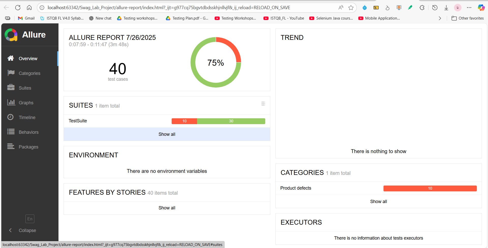
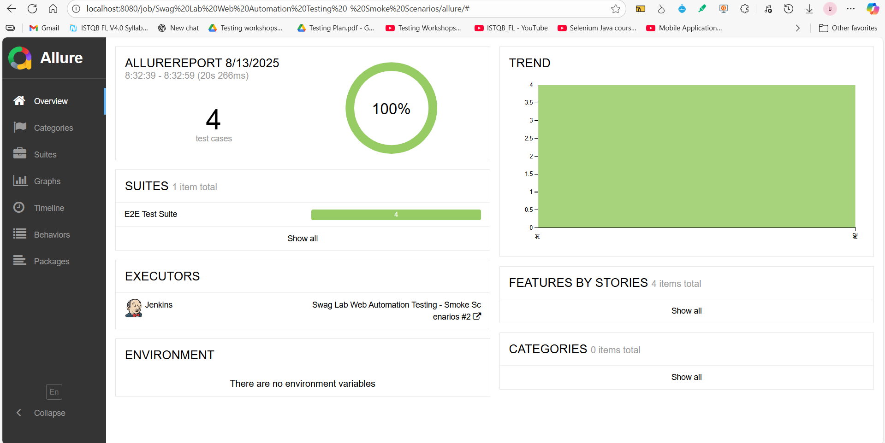

# 🧪 Swag Labs Web Automation Testing 

## 📌 Project Overview
The **Swag Labs Automation Testing Framework** is a comprehensive, maintainable, and scalable automated testing solution designed to validate the **Swag Labs** e-commerce web application.

This framework ensures that every release of the application meets **functional, regression, and smoke testing requirements** before deployment.  
It is built using **modern automation practices** with:

- **Java** for programming.  
- **Selenium WebDriver** for browser automation.  
- **TestNG** for test management and execution control.  
- **Page Object Model (POM)** for clean and reusable code.  
- **Data-Driven Framework** for running tests with multiple input data sets.  
- **Maven** for dependency and build management.  
- **Allure** for advanced reporting.  
- **Log4j2** for structured and trackable logging.  
- **Jenkins** for CI/CD.

---

## ✅ Key Features  

- **Modular design with Page Object Model (POM):** clean, reusable, and maintainable codebase.  
- **Centralized Driver Factory:** supports cross-browser setup and configuration.  
- **Custom Listeners:** integrated with TestNG for logging, screenshot capture, and reporting.  
- **Data-driven testing with JSON:** flexible and easy test data management.  
- **Parallel test execution:** reduces overall execution time.  
- **Profile-based execution (Maven Profiles):** run targeted suites like E2E, Smoke, Valid, Invalid, or Parallel.  
- **Integrated logging with Log4j2:** structured logs for better debugging.  
- **Utility classes for common actions:** reusable methods for waits, configurations, screenshots, and data handling.  
- **Allure Reporting:** detailed, interactive reports with screenshots and logs.  
- **Jenkins CI/CD pipeline:** automated build and test execution.  
- **Scalable TestNG XML suites:** multiple suites for regression, smoke, and scenario-based testing.  

---

## 🛠 Tech Stack
| Technology / Tool      | Purpose                                           |
| ---------------------- | ------------------------------------------------- |
| **Java**               | Main programming language                         |
| **Selenium WebDriver** | Web UI automation                                 |
| **TestNG**             | Test execution and management                     |
| **Maven**              | Build automation and dependency management        |
| **Allure Reports**     | Rich and interactive reporting                    |
| **Log4j2**             | Logging framework                                 |
| **Git**                | Version control and code collaboration            |
| **Jenkins**            | Continuous Integration and Delivery               |
| **JSON**               | Data-driven testing                               |

---

## 🔍 Test Coverage

This section summarizes the key modules and functionalities tested in the project to ensure the application works as expected.

- **Login:** Valid/invalid login, error messages, successful login.  
- **Home Page:** Page verification, navigation, product overview.  
- **Product Catalog:** View details, images, price, description.  
- **Shopping Cart:** Add/update/remove products.  
- **Checkout Process:** Multi-step checkout, user details, payment simulation.  
- **Order Overview:** Review order summary.  
- **Order Completion:** Final confirmation and validation.

---

## 📂 Project Structure
```plaintext
Swag_Lab_Project/
│
├── allure-report/                      # Auto-generated Allure HTML test reports
├── allure_result_screens/              # Screenshots taken during execution, organized by test type
│   ├── E2E_ResultScreen/               # Screenshots for End-to-End test cases
│   ├── Smoke_ResultScreen/             # Screenshots for Smoke test cases
│   └── Testing_ResultScreen/           # Screenshots for other general test cases
│
├── src/
│   ├── main/
│   │   ├── java/
│   │   │   ├── driver_factory/          # Handles WebDriver initialization, browser setup & configuration
│   │   │   ├── pages/                   # Page Object Model classes (locators & page-specific methods)
│   │   │   └── utilities/               # Helper classes: logging, waits, screenshots, clicking, sendKeys, advanced actions
│   │   └── resources/                   # Config files for Allure, Log4j, and environment setup
│
│   ├── test/
│   │   ├── java/
│   │   │   ├── e2e_scenarios/           # End-to-End tests (cover full workflows with valid & invalid cases)
│   │   │   ├── listeners/               # TestNG listeners for logging, reporting & retry mechanism
│   │   │   ├── paraller_execution/      # Classes handling parallel execution setup
│   │   │   ├── smoke_scenarios/         # Smoke test cases (basic critical flows validation)
│   │   │   ├── tests/                   # Main test classes grouped by functionality
│   │   │   └── utilitie/                # Extra helper classes for test layer (Allure, TestData)
│   │   └── resources/
│   │       └── TestData/                # Test data in JSON files for data-driven testing
│
├── target/                               # Maven build output (compiled classes, reports, etc.)
├── pom.xml                               # Maven dependencies & project configuration
├── testng.xml                            # Main TestNG suite (runs full test set)
├── e2e.xml                               # E2E suite: mix of valid + invalid scenarios
├── e2e_valid.xml                         # E2E suite: only valid workflows
├── e2e_invalid.xml                       # E2E suite: only invalid workflows
├── parallerExecuution.xml                # Suite file for running tests in parallel
├── smoke.xml                             # Suite file for smoke testing
└── README.md                             # Project documentation

```
---

## ⚙️ Prerequisites  

Before running the tests, make sure you have the following installed on your machine:  

- **Java 21** (set `JAVA_HOME` properly).  
- **Maven 3.8+** for build & test execution.  
- **Allure Commandline** for generating test reports.  
- **Git** for cloning the repository.  
- **Microsoft Edge Browser** (latest stable).  
- **Edge WebDriver (msedgedriver.exe)** matching your Edge version.  
- **Jenkins** (for Continuous Integration and scheduled test execution).  

---

## ▶️ How to Run  

 Clone the repository:  
   ```bash
   git clone https://github.com/nour-allah-khaled/Swag_Lab-Web-Automation-Project
   cd Swag_Lab-Web-Automation-Project
   ```
---

## ▶️ Run the tests using Maven profiles

 ### 🟡 Run Testing Suite 
 ```bash
 mvn clean test -Ptesting
 ```
 ### 🟢 Run E2E Tests  
 ```bash
 mvn clean test -Pe2e
 ```
 ### ✅ Run Valid E2E Scenarios
 ```bash
 mvn clean test -Pe2e_valid
 ```
 ### ❌ Run Invalid E2E Scenarios
 ```bash
 mvn clean test -Pe2e_invalid
 ```
 ### ⚡ Run Smoke Tests
 ```bash
 mvn clean test -Psmoke
 ```
 ### 🔀 Run Tests in Parallel
 ```bash
 mvn clean test -Pparaller
 ```
---

## 📊 Allure Reports  
To generate and view Allure reports after test execution, run:  
```bash
mvn allure:serve
```
## 📸 Sample Allure Reports  
Below are sample screenshots from the Allure report:

### 🧪 General Testing  


### 🟢 E2E Scenarios  

  
### ⚡ Smoke Tests  


---

## 🤖 Jenkins Integration  

- The project is **integrated with Jenkins** for Continuous Integration (CI).  
- Any test suite (Smoke, E2E, Parallel) can be triggered directly from Jenkins.  
- **Allure Report plugin** in Jenkins is used to generate and visualize detailed reports.  
- Jenkins ensures:  
  - Automated execution on every code change.  
  - Faster feedback loop for the team.  
  - Centralized reporting of test results.

---

## 💡 Ideas for Extension  

- 🌐 Cross-Browser Testing  
- 📝 Jira Integration  
- 🔗 API Testing with Rest Assured

---

## 👤 Author / Contact  

**Nour Allah Khaled**  
[LinkedIn Profile](https://www.linkedin.com/in/nour-allah-khaled)

---

